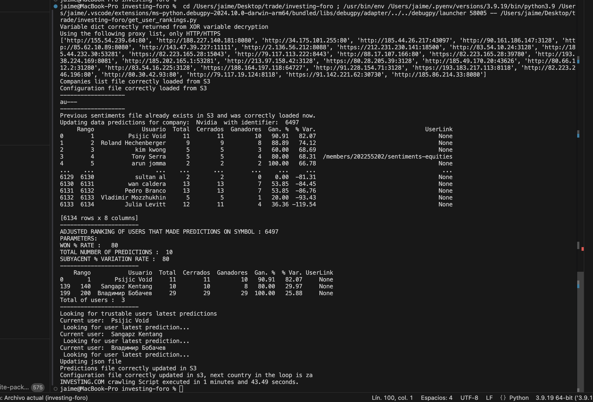

## INVESTING:COM Sentiments Analysis Alerting System

Repository that monitores the behaviour of the best users in [INVESTING](https://investing.com) user forum.

The idea is to create a system that monitors the sentiments that the top performing users create on top companies.

## INSTALATION/ PUT THIS IN RUN MODE

Follow below steps to run it. This is intented to be run inside a EC2 instance in AWS, S3 is where the storage and configuration data will reside.

1. Input the companies you want to put an aye on in the file companies_to_watch.json. Evey company in that configuration file has the following attribute structure:

    ````json
    {
                "identifier" : 32237, 
                "name": "Ezentis",
                "win_percentage" : 80,
                "number_of_predictions": 10,
                "variation_percentage" : 20
    }

* identifier: This number can be obtained by inspecting the browser's network and noting down the ?identifier query string that is used in the AJAX call that retreives the user ranking
* name: Used inside the function find_latest_user_prediction_scrapper(), to filter those user predictions in the user page belonging to the company, this value can also be identified inspecting the browser's network.
* win_percentage: This is the result of user correct predictions / user total predictions, or how many times is the user correct out of all the tries.
* number_of_predictions: This parameter is used to filter out those users that do not have the correct level of depth.
* variation_percentage: How much % of benefit could that user have obtained by investing all the predictions made.

2. If restarting (starting again) the application clean up the latest_reliable_sentiments.json file by leaving the realiable_sentiments object empty. If not restarting, leave as is. You can always keep the latest sentiments there, since they are not useful and the application will try to retrieve them at the beggining if the user didn't create any other sentiment.

    ````json 
    {"reliable_sentiments": []}
    `````

    - If you are restarting the application you should also delete the log (only if it exists) that should be in the instance were the application is running.

3. Install requirements.

    - Install virtualenv, Create a virtual env, Activate virtual env
    ```console
        pip3 install virtualenv
        virtualenv venv
        source venv/bin/activate
    ```
    - Python modules
    ```console
    pip3 install -r requirements.txt
    ```

4. Run the get_user_rankings.py file. This file should be run on cron mode, f.e. every 15 minutes, and send the new alerts via email. This code has the following structure:

    - 4.1 Loop the companies in the json file. Apply below steps for every company.
    - 4.2. Get the user ranking for every company in the function get_user_ranking
    - 4.3 Apply trust conditions. In this function the input parameters set for every company are used to filter the rankings dataset and get only the best predictors. This is done in the apply_trust_conditions() function
    - 4.4 Execute the find_latest_user_prediction_scrapper() function, which will get, for every "trusted" user, the latest prediction made. If this prediction does exist in the latest_reliable_sentiments.json file, it will do nothing, if it doesn't exist, it will send an email with the predition (send_email()) and it will add it to the json file tracking the predictions.

In order to create then cron job, input this line inside your crontab jobs:

```console
*/30 * * * * /usr/bin/python3 /home/ec2-user/investing-foro/get_user_rankings.py
```

You can also run below command at any time inside the EC2 instance to check all the curernt python runnig processes:

```console
ps -ef | grep python
```

This will run the application every 30 minutes.

## Architecture

Below is shown a diagram with the design/ architecture of the full concept.


## Results

Below is shown the terminal output of a correct execution:



October 2024.